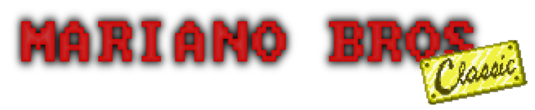
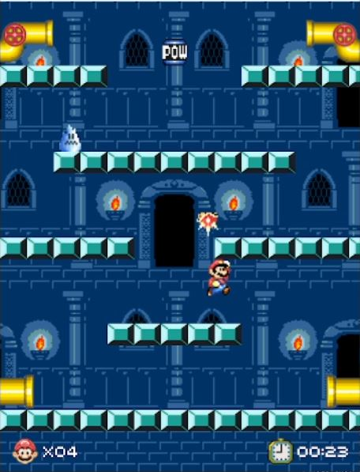

<section align="center">

Mariano bros classic es un acade clasico inspirado en el Super Mario Bros 3, contaremos con tres niveles

Las mecánicas del juego son las siguiente:
Para atacar a los enemigos tendremos que golpear por debajo a la plataforma donde se encuentran, existen tres tipos de enemigos:

Koopa -> Muere con un solo golpe a la plataforma

Cangrejo -> Con un golpe a la plataforma lo tumbaremos, si después de un tiempo tumbado 
            no lo golpeamos directamente este volverá a moverse, si lo matamos nos da un punto de vida en cambio sí nos golpea moviéndose nos quita un punto de vida.

Hielo -> Solo puede ser eliminado por el jugador al activar el POW, no quita
            vida al chocar con él, pero si ralentiza al jugador y le limita el salto. 
Al comenzar el nivel algunos enemigos se generarán en la carga de mapa después de pasado un tiempo más enemigo se irán generando cada un tiempo determinado hasta que no queden más por generar.

Ademas apareceran monedas que nos dan puntuacion y el bloque especial POW que al activarlo 
da un golpe a todos los enemigos en pantalla.

Los controles mediante teclado son los siguientes:

Tecla A: mover al jugador a la izquierda 

Tecla D: mueve al jugador a la derecha. 

Tecla W: salto 

(Controles en la pantalla de menu y final)
Tecla Espacio: en las pantallas con botón (menú y final) lo activa (También se puede activar ese botón con el click izquierdo del ratón) 

Sistema de Puntuacion:
La puntuación final es la acumulada de la obtenida en cada nivel, esta se calcula: 
Cada vida con las que el jugador acaba vale 50 puntos.
Cada moneda obtenida vale 5 puntos.

El tiempo también computa para la puntuación de la siguiente manera. 
El máximo de puntos que se pueden obtener son 500 puntos si el jugador acaba el nivel antes de los 2 minutos (el tiempo que se tarda en generar todos los enemigos). De esos 500 se irán restando 50 puntos por cada 10 segundos que el jugador se pase de los 2 minutos en acabar el nivel. 

</section>

<section align="center">
<h2>
-Como desplegar el juego-
</h2>

El juego esta desarrollado en C++ usando la librería grafica SDL2 (Simple DirectMedia Layer) versión win32.

El entorno de desarrollo elegido es Visual Studio Community versión 2019 con los paquetes de desarrollo de escritorio C++ y .Net.

Para la configuración del proyecto crearemos una global (todas las configuraciones y plataformas) en C/C++ -> General -> Directorios de inclusión adicionales añadimos el directorio videojuegos/include del proyecto.
Además desde Vinculador -> General -> Directorio de bibliotecas adicionales y añadimos el directorio videojuegos/lib.

También desde Vinculador -> Entrada -> Dependencias adicionales, añadimos la siguiente línea que es una referencia a las librearias que necesita: opengl32.lib; SDL2.lib; SDL2main.lib; SDL2_image.lib; SDL2_ttf.lib;  SDL2_mixer.lib

Una vez configurado el proyecto se puede ejecutar en modo Debug x86.

</section>